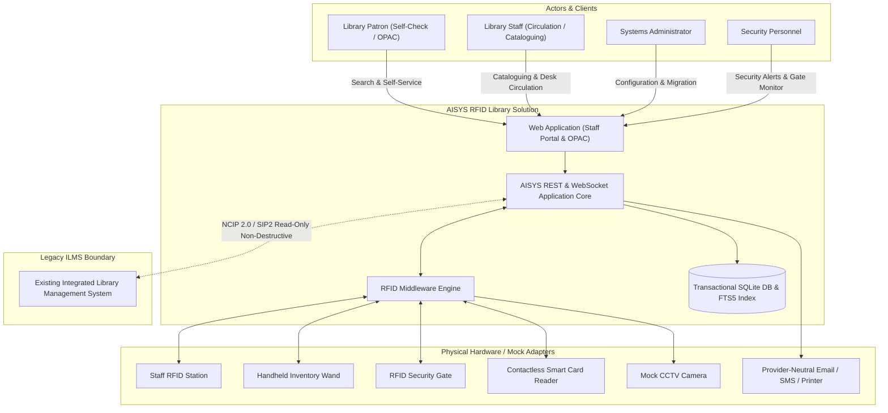

# Deliverable D2: System Context and Component Architecture

## 1. Executive Summary
The AISYS RFID-enabled Library Solution is built upon a 7-layer modular architecture designed for high cohesion, low coupling, deterministic testability, and resilient offline execution in air-gapped institutional environments.

---

## 2. System Context Diagram (C4 Level 1)



---

## 3. Seven-Layer Component Architecture (SOP Section 6)

```mermaid
flowchart TD
    subgraph Layer1 ["1. User Layer"]
        StaffWeb["Staff Management Web Console"]
        OPAC["Patron OPAC & Virtual Bookshelf"]
        DashUI["Analytics Dashboard & Reports UI"]
        AdminUI["System Admin & Migration Center"]
        HardwareSimUI["Integrated Hardware Simulator & Audio Feedback"]
    end

    subgraph Layer2 ["2. Application Layer"]
        CatSvc["Cataloguing & Spine-Label Service"]
        CircSvc["Circulation & Policy Rule Engine"]
        MemberSvc["Member & Card Association Service"]
        FineSvc["Fine Assessment & Clearance Service"]
        InvSvc["Shelf Inventory & Stock Verification"]
        SearchSvc["FTS5 Full-Text Search Engine"]
        ReportSvc["Audit & Statistical Reporting Engine"]
    end

    subgraph Layer3 ["3. RFID Middleware Layer"]
        DevBus["Device-Neutral Event Bus & Dispatcher"]
        StaffStationAdapter["Staff Station Reader Adapter"]
        HandheldAdapter["Handheld Reader Inventory Streamer"]
        SecurityGateEngine["Security Gate EAS/AFI Monitor"]
        SmartCardAuthAdapter["Smart Card UID Resolver"]
    end

    subgraph Layer4 ["4. Interoperability Layer"]
        NCIPAdapter["NCIP 2.0 Adapter (XML / JSON)"]
        SIP2Adapter["3M SIP2 Protocol Boundary & Parser"]
        MockILMSSync["Legacy ILMS Read-Only Connector"]
    end

    subgraph Layer5 ["5. Data Layer"]
        TxDB[(Transactional SQLite Engine (WAL Mode))]
        FTS5Index[(Real-Time FTS5 Search Virtual Tables)]
        StagingArea[(Migration Staging & Error Tables)]
        BackupProc["Atomic Hot-Backup & Restore Engine"]
    end

    subgraph Layer6 ["6. Integration Layer"]
        EmailMock["Email Dispatcher (SMTP / Mock Spool)"]
        SMSMock["SMS Gateway Adapter"]
        PrintMock["Thermal Spine/Receipt Print Adapter"]
        CCTVMock["CCTV Frame Grabber & Storage"]
    end

    subgraph Layer7 ["7. Operations Layer"]
        ConfigMgr["Configuration & Secrets Manager"]
        AuditTrail["Immutable Audit Log Service"]
        HealthDiag["Health Diagnostics & Liveness Probes"]
        OfflineUpd["Offline Patch & Rollback Manager"]
    end

    Layer1 --> Layer2
    Layer2 --> Layer5
    Layer2 <--> Layer3
    Layer2 <--> Layer4
    Layer3 <--> Layer6
    Layer2 --> Layer6
    Layer7 -.->|Applies to all layers| Layer2
    Layer7 -.->|Manages| Layer5
```

---

## 4. Layer Responsibilities & Interactions

### 4.1 User Layer
- **Responsibility**: Responsive, accessible interface served from the backend. Incorporates Web Audio API synthesis for auditory cues (high-frequency beep for successful read, low-frequency buzz for error or misplaced item, siren for gate breach).
- **Security**: Token-based authentication (session cookie / Bearer token) and client-side view customization mapped to verified server RBAC roles.

### 4.2 Application Layer
- **Cataloguing Service**: Validates bibliographic MARC/Dublin Core metadata, allocates accession numbers, formats printable spine and barcode labels.
- **Circulation Service**: Evaluates policy rules before authorizing check-out: checks `patron.is_blocked == 0`, `patron.current_fines <= config.max_fine_limit`, and `biblio.is_reference == 0`.
- **Search Service**: Synchronously indexes titles, authors, subjects, and accession numbers in SQLite FTS5 for sub-millisecond query response over 100,000 records.

### 4.3 RFID Middleware Layer
- **Abstraction**: Encapsulates vendor-specific low-level serial/Ethernet commands (LLRP, FEIG, Nordic ID, Alien) behind a clean Python interface: `RFIDDevice`, `read_tag()`, `write_tag()`, `set_eas()`, `get_eas()`.
- **EAS / Security Bit**: Implements AFI/EAS byte switching (`0x00` = Armed, `0x01` = Disarmed). Security gate independently inspects this bit without requiring online database lookups.

### 4.4 Interoperability Layer
- **NCIP 2.0**: Implements `LookupUser`, `CheckOutItem`, `CheckInItem`, `RenewItem` with standard XML responses.
- **3M SIP2**: Implements message frames `11/12` (Checkout), `09/10` (Checkin), `29/30` (Renew), `63/64` (Patron Information), validating checksums and sequence delimiters.
- **Non-Destructive ILMS Guarantee**: Reads legacy tables without performing any schema alterations, `DELETE`, or `DROP` statements (NFR 01).

### 4.5 Data Layer
- **Storage**: SQLite 3 with Write-Ahead Logging (WAL) enabled, achieving high read/write concurrency and zero external server dependencies.
- **Isolation**: Staging area for migration is partitioned from production catalog tables.

### 4.6 Integration Layer
- **Peripherals**: Provider-neutral abstract adapters with mock file-based spools and mock hardware responders for Email, SMS, thermal receipt/label printing, and CCTV security snapshot capture.

### 4.7 Operations Layer
- **Configuration**: JSON-driven configuration outside source code (`config/sample_config.json`).
- **Health Diagnostics**: Real-time `/api/admin/health` verifying DB connectivity, disk space, and RFID adapter states.
