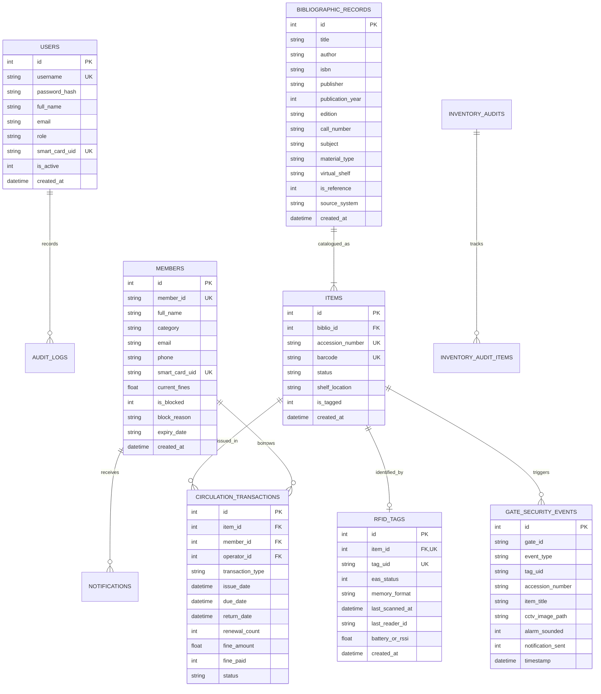

# Deliverable D2: Database Schema & Indexing Design

## 1. Relational Entity-Relationship Model



---

## 2. Full-Text Search Table (`biblio_fts`)

To fulfill **FR 02** ("Provide a web interface, full-text search, search engine, real-time indexing"), SQLite's FTS5 virtual table engine is employed:

```sql
CREATE VIRTUAL TABLE biblio_fts USING fts5(
    title,
    author,
    isbn,
    subject,
    call_number,
    content='bibliographic_records',
    content_rowid='id'
);
```

### Real-Time Synchronous Triggers
Triggers keep `biblio_fts` updated synchronously upon any insertion, update, or deletion in `bibliographic_records`:
- `trg_biblio_ai`: AFTER INSERT ON `bibliographic_records` -> inserts into `biblio_fts`.
- `trg_biblio_ad`: AFTER DELETE ON `bibliographic_records` -> deletes from `biblio_fts`.
- `trg_biblio_au`: AFTER UPDATE ON `bibliographic_records` -> updates `biblio_fts`.

---

## 3. High-Concurrency Performance Tuning

1. **Write-Ahead Logging (WAL)**:
   ```sql
   PRAGMA journal_mode = WAL;
   PRAGMA synchronous = NORMAL;
   PRAGMA foreign_keys = ON;
   PRAGMA busy_timeout = 5000;
   ```
   WAL allows concurrent readers while a write is occurring, ensuring zero reader blockage during active circulation, gate events, or migration batch processing.
2. **Index Optimization**:
   - `idx_items_accession`: `CREATE INDEX idx_items_accession ON items(accession_number);`
   - `idx_items_barcode`: `CREATE INDEX idx_items_barcode ON items(barcode);`
   - `idx_rfid_tag_uid`: `CREATE INDEX idx_rfid_tag_uid ON rfid_tags(tag_uid);`
   - `idx_circ_member_active`: `CREATE INDEX idx_circ_member_active ON circulation_transactions(member_id, status);`
   - `idx_members_card_uid`: `CREATE INDEX idx_members_card_uid ON members(smart_card_uid);`
   - `idx_users_card_uid`: `CREATE INDEX idx_users_card_uid ON users(smart_card_uid);`
