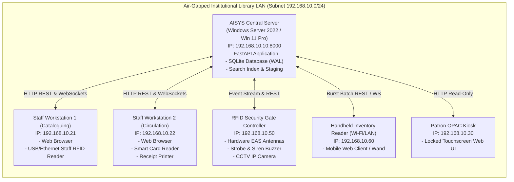

# Deliverable D2: Deployment and Isolated Network Architecture

## 1. Network Topology (Isolated / Air-Gapped Environment)

AISYS is engineered to operate in institutional libraries with strict air-gapped or isolated LAN environments where external Internet connectivity is forbidden or unreliable.

---

## 2. Target Operating System Compatibility

### 2.1 Server Host
- **Operating System**: Windows Server 2022 Datacenter/Standard or Windows 11 Pro (64-bit).
- **Runtime**: Python 3.12 64-bit embedded or pre-installed virtual environment.
- **Service Hosting**: Runs as a Windows Service (via NSSM or Windows Task Scheduler) or headless background process.
- **Port Allocation**:
  - `8000`: Primary HTTP / WebSocket API & Static Web Portal.
  - `6001`: Mock SIP2 TCP Socket Server (optional raw socket boundary).

### 2.2 Client Workstations
- **Operating System**: Windows 11 Enterprise / Pro, Windows 10 (21H2+).
- **Web Browser**: Microsoft Edge (Chromium engine) or Google Chrome (offline enterprise MSI).
- **Hardware Peripherals**:
  - Staff RFID Reader: USB HID / Virtual COM Port (FTDI) or Ethernet TCP.
  - Patron Smart Card Reader: PC/SC compliant USB reader or RFID UID mock.
  - Thermal Slip / Label Printer: Standard Windows Spooler driver or ESC/POS emulator.

---

## 3. Offline Lifecycle and Air-Gapped Maintenance Strategy (FR 12, AC 09)

In an isolated environment without access to PyPI, npm, GitHub, or public CDNs:

1. **Self-Contained Distribution Package**:
   - The application bundles all client-side dependencies (CSS stylesheets, JavaScript runtime, fonts, SVG icons) directly in `src/static/`.
   - All Python wheels are stored in a dedicated local offline wheelhouse (`wheelhouse/`).
2. **Offline Installation Process**:
   - Run `tools/offline_installer.py --install-dir C:\AISYS --isolated`.
   - The installer verifies pre-requisites, extracts the wheelhouse, applies baseline schema migrations `data/migrations/`, creates initial administrative credentials, and registers the server service.
3. **Offline Patching and Upgrades**:
   - Software updates are delivered via a cryptographically signed tarball/zip archive (`aisys_update_vX.Y.Z.pkg`) containing:
     - Updated source bytecode or module diffs.
     - New database migration SQL scripts (e.g. `V2__features.sql`).
     - Update manifest with SHA-256 integrity hashes.
   - The update runner (`tools/offline_updater.py`) captures a pre-update hot backup of the SQLite database and application state before applying changes.
4. **Automated Rollback Guarantee**:
   - If post-upgrade automated health checks fail (or upon administrator invocation `--rollback`), the updater reverses the database migration and restores the exact file snapshot in under 10 seconds.
