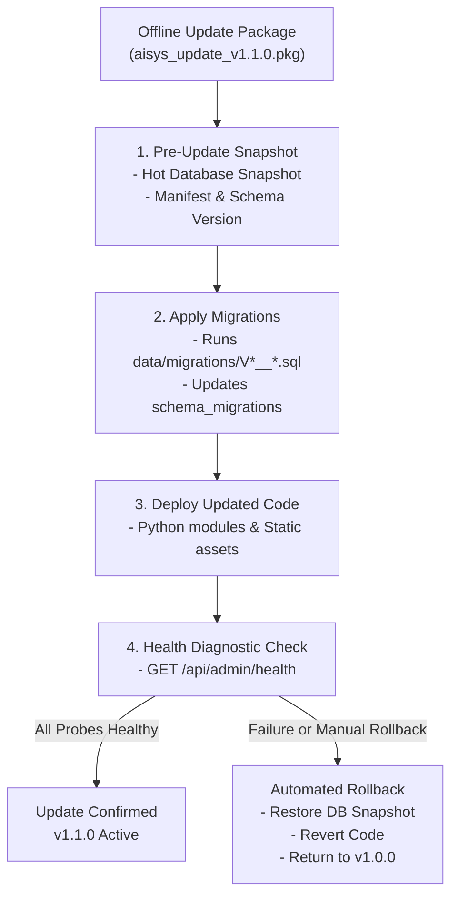

# Deliverable D7: Offline Update & Automated Rollback Runbook

## 1. Overview
In air-gapped institutional environments, software patches, feature updates, and database schema migrations must be applied without requiring public repository access, with zero data loss, and with an immediate rollback mechanism.

---

## 2. Offline Update Lifecycle Architecture



---

## 3. Applying an Offline Update

### Command:
```powershell
python tools/offline_updater.py --update 1.1.0
```

### Execution Steps:
1. Automated snapshot created at `storage/backups/update_snapshots/snapshot_v1.0.0_YYYYMMDD_HHMMSS/`.
2. New migrations in `data/migrations/` (e.g. `V2__additional_indexes.sql`) applied cleanly.
3. System metadata updated to reflect version `1.1.0`.
4. Audit trail records `OFFLINE_UPDATE_APPLIED`.

---

## 4. Executing an Automated Rollback

If any post-upgrade issue or unexpected behavior is detected:

### Command:
```powershell
python tools/offline_updater.py --rollback
```

### Execution Steps:
1. Locates latest pre-update snapshot directory.
2. Restores pre-update SQLite database cleanly.
3. Reverts schema version state.
4. Restores system version to `1.0.0`.
5. Audit trail records `OFFLINE_UPDATE_ROLLBACK`.
